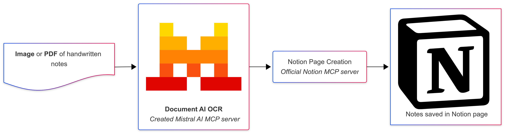

# Mistral OCR MCP Server

A Model Context Protocol (MCP) server that provides OCR (Optical Character Recognition) functionality using Mistral's OCR API. This server allows you to extract text content from PDF files and images through MCP-compatible clients like Cursor and Claude Desktop.

## Flowchart



## Features

- Extract text from PDF files and images (JPG, JPEG, PNG, TIFF, BMP)
- Returns structured content with page-by-page breakdown
- Integrates seamlessly with MCP clients
- Built with FastMCP for optimal performance

## Prerequisites

- [uv](https://docs.astral.sh/uv/) package manager
- Python 3.10.1 or higher (but less than 3.13)
- Mistral API : [https://console.mistral.ai/api-keys](https://console.mistral.ai/api-keys)

## Installation

1. **Clone the repository:**
   ```bash
   git clone <repository-url>
   cd mistral-ocr-mcp
   ```

2. **Install dependencies using uv:**
   ```bash
   uv sync
   ```

3. **Set up environment variables:**
   Create a `.env` file in the project root:
   ```bash
   echo "MISTRAL_API_KEY=your_mistral_api_key_here" > .env
   ```

## Configuration for MCP Clients

### Claude Desktop

Add the following configuration to your Claude Desktop config file:

**Location:** `~/Library/Application Support/Claude/claude_desktop_config.json` (macOS)

```json
{
  "mcpServers": {
    "mistral-ocr": {
      "command": "/Users/yourusername/.local/bin/uv",
      "args": [
        "--directory",
        "/path/to/mistral-ocr-mcp",
        "run",
        "main.py"
      ]
    }
  }
}
```

**Important:** Replace `/path/to/mistral-ocr-mcp` with the actual path to your cloned repository.

### Cursor

For Cursor, add similar configuration to your MCP settings. The exact location may vary depending on your Cursor setup.

## Usage

Once configured, the server provides the following tool:

### `extract_file_content`

Extracts text content from PDF files and images.

**Parameters:**
- `file_path` (string): Local path to the PDF or image file

**Returns:**
- Extracted text content as a string

**Supported formats:**
- PDF files (`.pdf`)
- Image files (`.jpg`, `.jpeg`, `.png`, `.tiff`, `.bmp`)

**Example usage in Claude Desktop:**
```
Please extract the text from this document: /path/to/your/document.pdf
```

## Development

### Running the server directly

```bash
uv run main.py
```

### Project structure

```
mistral-ocr-mcp/
├── mistral_ocr/          # Package directory
│   ├── __init__.py       # Package initialization
│   └── extractor.py      # Mistral OCR functionality
├── docs/                 # Documentation
│   └── flowchart.png     # Architecture flowchart
├── main.py               # MCP server implementation
├── pyproject.toml        # Project dependencies and configuration
├── uv.lock              # Dependency lock file
├── .env                 # Environment variables (create this)
├── .gitignore           # Git ignore rules
└── README.md            # This file
```

## Environment Variables

- `MISTRAL_API_KEY`: Your Mistral API key (required)

## Troubleshooting

1. **"MISTRAL_API_KEY must be set" error:**
   - Ensure you've created a `.env` file with your Mistral API key
   - Verify the API key is valid

2. **"File not found" error:**
   - Check that the file path is correct and accessible
   - Ensure the file format is supported

3. **MCP connection issues:**
   - Verify the path to `uv` is correct in your MCP configuration
   - Ensure the repository path is absolute and correct
   - Check that all dependencies are installed with `uv sync`
